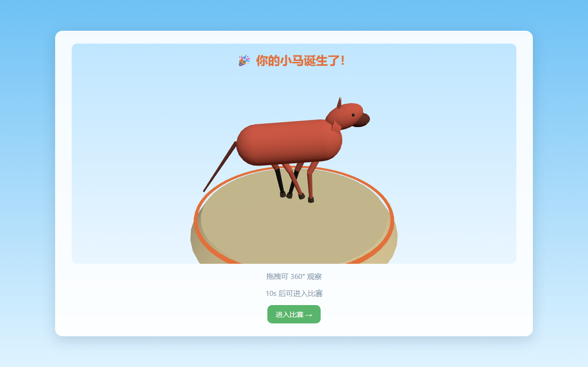
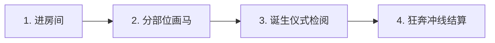
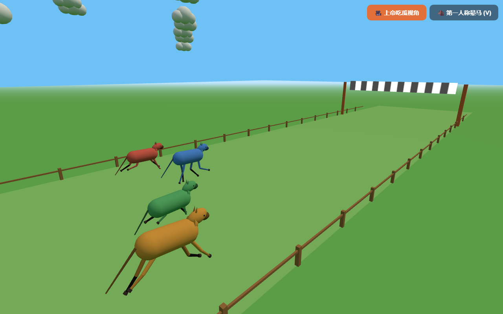
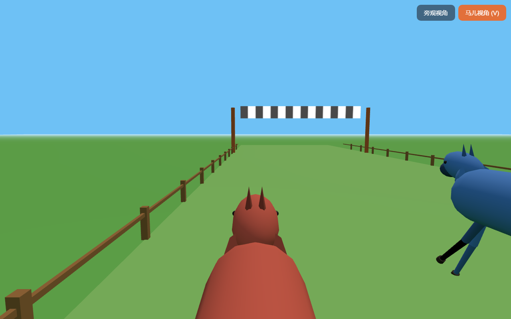

<div align="center">

# 🐎 奔跑即故障 · Up2Down

### 牛来马翻，边画边瘫！

**不能只让作者一个人吃上这种细糠😭**

<br/>

分部位接力绘画 · 3D 双关节物理步态 · 实时 WebRTC 直连 · 最多 4 人同屏竞速

<br/>

[](https://up2down.arr2018.dpdns.org)

<br/>

[](LICENSE)
[](#-游戏特色)
[](https://react.dev)
[](https://www.typescriptlang.org)
[](https://threejs.org)
[](docs/ARCHITECTURE.md)
[](signaling/)

<br/>

`#网页联机游戏` &nbsp;•&nbsp; `#分部位绘画` &nbsp;•&nbsp; `#物理步态模拟` &nbsp;•&nbsp; `#WebRTC点对点` &nbsp;•&nbsp; `#零安装即开即玩`

<br/>



*🎉 绘制完毕后的小马诞生仪式：3D 旋转登场，支持 360° 拖拽观察你的杰作*

</div>

<br/>

---

## 📖 这是什么游戏？

**《奔跑即故障》（Up2Down）** 是一款脑洞大开的 **多人在线绘画赛跑派对网页游戏**。

在这里，没有预设的角色模型，每一匹马都来自玩家的亲手绘制！更魔性的是，**你画的身体比例将直接决定小马在赛道上的奔跑速度**：
- 腿太长？步幅很大但步频很慢！
- 腿太短？频率飞快但步幅极小！
- 大腿与小腿比例失调？动作滑稽还跑不快！

叫上 1~3 位好友，在浏览器中输入相同房间号，看谁能画出奔跑效率最高（或者最抽象）的冠军赛马！

---

## ✨ 核心特色

- 🎨 **三阶段分部位绘制**  
  腿部 ➔ 头部 ➔ 屁股，每个部位限时 50 秒。无需绘画功底，躯干由系统根据关节自动连线生成。
- 🎂 **震撼的「小马诞生仪式」**  
  画作完成后，镜头推向聚光灯舞台。你的小马 3D 旋转放大登场，彩带与庆祝音效齐飞，支持鼠标/手指拖拽 360° 细细端详。
- 📐 **几何决定速度 · 双关节运动学**  
  算法精确解析出「髋关节 + 膝关节」连杆结构。腿长、大腿/小腿比例（约 1.05:1 最优）、笔画质量综合计算速度，步态严格物理正解。
- 🎥 **双重视角随心切换**  
  比赛全程支持 **第三人称旁观视角** 与 **第一人称马儿沉浸视角** 自由切换，感受被自己画出的马儿颠簸冲刺的快乐。
- ⚡ **零安装 · 极速 P2P 直连**  
  基于 WebRTC DataChannel 网状直连，画作与赛况纯端对端传输，不经中心服务器。即使穿不透 NAT 也会无缝降级走 Worker 极速转发。

---

## 🎮 怎么玩？玩法与操作

### 1. 四步轻松开局



1. **进入房间**：打开游戏网页，输入昵称与房间号，把房间号分享给好友（最多支持 4 人同房）。
2. **分部位绘画**：房主点击「开始比赛」，全员同时开始作画。按顺序绘制 **腿部**（画 4 条腿）、**头部**（颈头与耳朵）、**屁股**（尾巴与臀部线条）。
3. **诞生仪式**：三部位画完后进入 3D 展台，检阅你的独门战马，全员准备就绪即可起跑！
4. **开跑夺冠**：赛道鸣枪起跑！各匹小马按物理步态狂奔，最先撞线的赛马获得第一名！

### 2. 赛道实况

<div align="center">

| 第三人称上帝视角 | 第一人称马儿视角（按 V 键） |
| :---: | :---: |
|  |  |
| *俯瞰跑道，纵览 4 匹抽象小马的搞笑冲刺* | *身临其境，第一人称感受马头晃动与前蹄狂踏* |

</div>

### 3. 操作指南

| 场景 | 操作按键 / 手势 | 说明 |
| :--- | :--- | :--- |
| **画布绘制** | 鼠标左键拖拽 / 触屏滑动 | 画出部位线条（腿部建议画足 4 条笔画） |
| **画布撤销/清空** | 界面按钮 | 撤销上一笔或清空重画 |
| **诞生仪式舞台** | 鼠标拖拽 / 触屏拖动 | 360° 旋转观察小马全身细节 |
| **比赛视角切换** | **键盘 `V` 键** 或 点击右上角切换按钮 | 在「旁观视角」与「马儿视角」之间无缝切换 |
| **重开下一局** | 比赛结束后房主点击「再来一局」 | 全员带原房间直接回大厅，继续下一轮创作 |

---

## 🏁 速度公式：怎样画能跑得最快？

> [!TIP]
> 觉得自己的马跑得太慢？看看底层的物理速度评估逻辑：

$$\text{最终速度} = \text{步幅}(L) \times \text{步频}\left(\frac{1}{\sqrt{L}}\right) \times \text{比例效率}(\eta) \times \text{质量系数}(Q)$$

- **步幅**：腿长越长，单步距离越远；
- **步频**：钟摆效应，腿越长摆动周期越长；
- **比例效率 $\eta$**：系统会自动在腿部笔画的拐弯处寻找膝关节。当 **大腿长 : 小腿长 $\approx 1.05 : 1$** 时效率最高，比例严重失衡会损失速度；
- **质量系数 $Q$**：若画足 4 条完整腿，$Q=1.0$；若缺腿由系统自动补全合成腿，将受到 $Q=0.7$ 的惩罚。

> [!NOTE]
> 赛跑过程在所有客户端采用确定性纯函数模拟（Deterministic Simulation），输入相同则各端结果完全一致，绝无作弊与网络拉扯！

---

## 🌐 访问方式

### 方案 A：即刻在线畅玩（推荐）

无需下载安装任何软件，使用 Chrome、Edge、Safari 或 Firefox 等现代浏览器直接访问：

👉 **[https://up2down.arr2018.dpdns.org](https://up2down.arr2018.dpdns.org)**

> [!TIP]
> **一个人也能玩**：用同一个浏览器开 1 个普通标签页 + 1 个隐身窗口（或两个不同浏览器），输入同一个房间号，就能单机体验完整 2 人联机全流程！

### 方案 B：本地运行开发体验

如果你希望在本地运行或二次开发：

```bash
# 1. 克隆代码库
git clone git@github.com:Hfy1313113/Up2Down.git
cd Up2Down

# 2. 启动控制面（Cloudflare Worker + Durable Objects，提供房间信令）
cd signaling
npm install
npx wrangler dev          # 运行在 ws://localhost:8787

# 3. 在另一终端启动前端（Vite 开发服务器）
cd ../frontend
npm install
npm run dev                # 运行在 http://localhost:5173
```

在浏览器打开 `http://localhost:5173` 即可开始对局。

---

## 🛠 技术架构

整个游戏基于极简且现代化的 Serverless + P2P 架构打造：

```text
┌────────────────┐                     WebRTC DataChannel                     ┌────────────────┐
│   玩家 A 浏览器  │ ◄═════════════════════════════════════════════════════════► │   玩家 B 浏览器  │
└───────┬────────┘             （画作、开赛、步态全走 P2P，0 云端流量）            └────────┬───────┘
        │                                                                              │
        │ HTTP: 静态单页应用产物                                                          │
        │ WebSocket: 房间成员 / 信令交换 / 超时兜底                                       │
        └──────────────────────────────┬───────────────────────────────────────────────┘
                                       ▼
                     ┌───────────────────────────────────┐
                     │    Cloudflare Worker (up2down)    │
                     │  ├── [assets] 静态托管前端 SPA     │
                     │  └── Durable Object 房间状态路由    │
                     └───────────────────────────────────┘
```

- **前端架构**：React 19 + TypeScript + Vite，配合 **Three.js** 驱动 3D 角色网格生成、赛道环境与相机动力学；纯算法层（识别、指标、步态、模拟）无 DOM 依赖，全面单测覆盖。
- **传输层**：双层混合传输。默认建立全连接 WebRTC DataChannel Mesh 网络；遇到严苛 NAT 穿不透时，自动无缝回退至 Worker WebSocket 中转（Relay），保证可用性。
- **服务端**：单个 Cloudflare Worker 承担全部职责（静态 SPA 资产托管 + Durable Objects 信令与房间状态管理），零服务器运维开销。

---

## 📁 目录结构

```text
.
├── assets/
│   └── readme/           # README 使用的精美演示截图
├── frontend/             # 前端 React + Three.js + Vite 单页应用
│   ├── src/
│   │   ├── game/         # 纯算法：分部位骨骼识别 / 速度公式 / 步态计算 / 确定性赛跑
│   │   ├── net/          # 网络层：WebRTC P2P + Worker 信令 + 兜底中转 + 去重重连
│   │   ├── three/        # 3D 场景：连杆马匹模型、赛道相机、诞生仪式展台
│   │   ├── screens/      # 各阶段界面（大厅 / 绘制 / 诞生 / 等待 / 赛跑）
│   │   └── state/        # 状态机与房主协调逻辑
│   ├── tests/            # Vitest 核心算法单测
│   └── docs/             # 前端子模块深度设计文档
├── signaling/            # Cloudflare Worker 唯一服务端（静态托管 + DO 房间信令）
│   ├── src/index.ts      # Worker 入口与 Durable Object 房间实现
│   ├── scripts/          # 协议与信令自动化验证套件
│   └── docs/             # 服务端与部署文档
└── docs/                 # 项目级全局文档（系统架构、通信协议、快速开始）
```

---

## 🚀 部署指引

本项目设计为 **一个 Cloudflare Worker 项目搞定前后端全部**：

```bash
# 1. 构建前端静态资源（必须先构建，Worker assets 指向 frontend/dist）
cd frontend
npm run build

# 2. 部署到 Cloudflare Worker
cd ../signaling
npx wrangler login
npx wrangler deploy
```

部署完成后，访问绑定的生产域名（默认 `https://up2down.arr2018.dpdns.org`）即可开局。

---

## 📚 文档导航

| 文档路径 | 说明 |
| :--- | :--- |
| [docs/QUICK_START.md](docs/QUICK_START.md) | 本地完整联机测试、自动化脚本与环境配置 |
| [docs/ARCHITECTURE.md](docs/ARCHITECTURE.md) | 总体技术架构、确定性模拟原理与关键决策 |
| [docs/API.md](docs/API.md) | WebSocket 控制面协议与 WebRTC 数据面消息规范 |
| [frontend/docs/README.md](frontend/docs/README.md) | 前端算法、渲染层细节与开发调试入口 |
| [signaling/docs/README.md](signaling/docs/README.md) | Durable Object 房间模型、超时机制与信令测试 |

---

## ⚖️ 许可证与版权声明

本项目代码依据 **[GNU Affero General Public License v3.0 (AGPL-3.0)](LICENSE)** 许可证开放源代码。

> **版权声明**  
> Copyright (c) 2026 **Up2Down Authors & Contributors**. 保留所有权利。  
> 
> 本项目的游戏创意、玩法机制设计、美术呈现形态及相关文案与素材均享有知识产权保护。您可以遵照 AGPL-3.0 协议使用、学习、分发或提供网络托管服务，但任何对本项目的修改、衍生开发或网络服务提供均必须以相同的 AGPL-3.0 协议公开源代码，并完整保留原始版权声明与归属标识。
