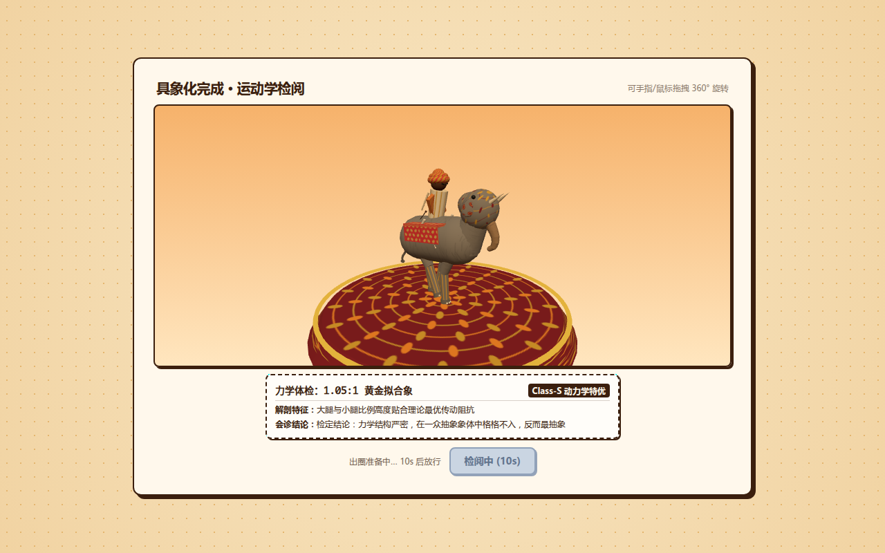
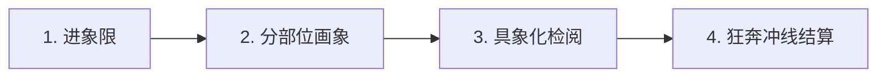
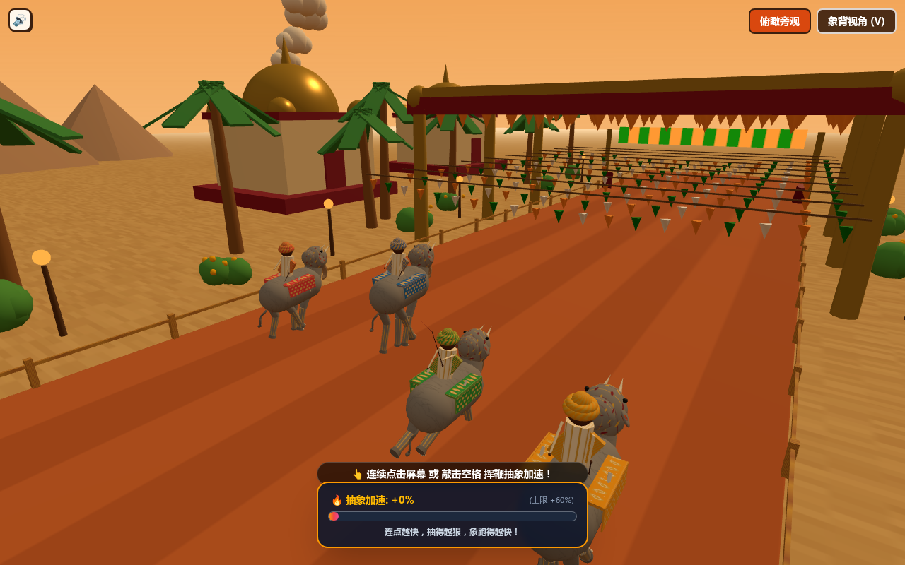
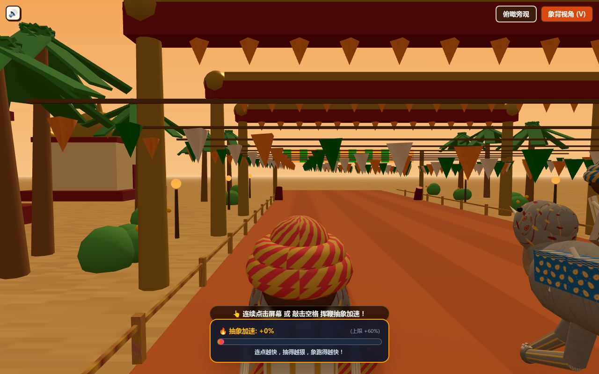

<div align="center">

# 🐘 抽象 · Up2Down

### 牛来象翻，边画边瘫！<br/><sub style="letter-spacing:0.5em;font-weight:900;">横批：抽象</sub><br/><sub><del style="color: gray; opacity: 0.65; font-weight: normal;">不能只让作者一个人吃上这种细糠😭</del></sub>

分部位接力画象 · 3D 双关节物理步态 · 可插拔风格包 · 实时 WebRTC 直连 · 最多 4 人同屏竞速

[](https://up2down.plutokeating.beer)

[](LICENSE)
[](#-核心特色)
[](https://react.dev)
[](https://www.typescriptlang.org)
[](https://threejs.org)
[](docs/ARCHITECTURE.md)
[](signaling/)

`#网页联机游戏` &nbsp;•&nbsp; `#分部位画象` &nbsp;•&nbsp; `#物理步态模拟` &nbsp;•&nbsp; `#风格包换皮` &nbsp;•&nbsp; `#WebRTC点对点` &nbsp;•&nbsp; `#零安装即开即玩`

<br/>



*🎉 画完之后的「具象化仪式」：3D 展台登场，拖拽 360° 围观你的抽象派杰作*

</div>

<br/>

---

## 📖 这是什么游戏？

**《抽象》（Up2Down）** 是一款脑洞大开的 **多人在线抽象画象赛跑派对网页游戏**。

抽象抽象抽象，抽的是大象，而且很抽象。这里没有预设的角色模型，每一头大象都来自玩家亲手绘制！更魔性的是，**你画的身体比例将直接决定大象在赛道上的奔跑速度**：
- 腿太长？步幅很大但步频很慢！
- 腿太短？频率飞快但步幅极小！
- 大腿与小腿比例失调？动作滑稽还跑不快！
- 象鼻画得歪七扭八？不影响速度，但很抽象！

叫上 1~3 位好友，在浏览器中输入相同象限号（房间号），看谁能画出奔跑效率最高（或者最抽象）的冠军象！

---

## ✨ 核心特色

- 🎨 **三阶段分部位绘制 · 浅虚线引导可描可弃**
  象腿 ➔ 象头鼻耳 ➔ 象臀尾线，每个部位限时 50 秒。画布提供清晰范围框与浅虚线轮廓引导，想稳妥就描边，想抽象就放飞；躯干由系统根据关节自动生成，无需绘制。
- 🐘 **象鼻、象牙、大扇耳**
  象鼻画了就按你的曲线分节建模，没画则程序化下垂回卷；耳尖识别为扇形大耳，象牙自动前伸。连点加速越猛，象鼻扬得越高。
- 🎂 **震撼的「具象化仪式」**
  三部位画完立即进入 3D 检阅展台：高空降临、触地踉跄、恢复平衡后礼炮彩带齐鸣，还附赠力学体检报告。
- 📐 **几何决定速度 · 双关节运动学**
  算法精确解析出「髋关节 + 膝关节」连杆结构。腿长、大腿/小腿比例（约 1.05:1 最优）、笔画质量综合计算速度，步态严格物理正解。
- 🎭 **风格包随时换皮**
  大象全身材质、驭象师全身着装与附件、赛道建筑植被装饰、诞生展台、2D 界面配色、背景音乐与音效全部由风格包声明。房主在大厅滑动选择，全员同步；新增风格只需新建一个目录。
- 🎵 **按风格播放的背景音乐**
  每套风格包自带正赛、大厅与具象化曲目，由 WebAudio 程序化合成；也可放入自己的音频文件，缺失时自动回落。
- 🎥 **双重视角随心切换 · 支持自由环视**
  比赛全程支持 **第三人称俯瞰视角**（镜头始终聚焦自己的大象）与 **第一人称象背视角**（支持拖拽转头环视四周对手）。
- 📺 **驭象师面部直播画中画**
  无论哪种视角，右下角都有一台正对你驭象师脸的「直播机位」（独立渲染层，象头与路灯都挡不住）。每位玩家一张不同的脸（闷闷 / 八字胡 / 乐呵 / 困倦），
  连点挥鞭越猛，表情从不爽、怒视到咬牙冒汗，脑袋抖动、挤压拉伸，镜头贴近、歪斜、红光压边，抽得酣畅淋漓；被甩下象背后切成「升天实况」。
- 🎉 **终点冲线礼花筒庆典**
  第一名撞线瞬间，跑道终点大门两侧礼花筒震撼鸣放，漫天彩带飞舞！
- ⚡ **零安装 · 极速 P2P 直连**
  基于 WebRTC DataChannel 网状直连，画作与赛况纯端对端传输，不经中心服务器。即使穿不透 NAT 也会无缝降级走 Worker 极速转发。

---

## 🎮 怎么玩？玩法与操作

### 1. 四步轻松开局


```mermaid
graph LR
    A[1. 进象限] --> B[2. 分部位画象]
    B --> C[3. 具象化检阅]
    C --> D[4. 狂奔冲线结算]
```

1. **进入象限**：打开游戏网页进入 `/play`，输入昵称与四位象限号，把象限号分享给好友（最多支持 4 人同房，满员会直接提示）。房主在大厅滑动选择风格包，全员实时同步预览。若房间里的一局正在进行，你会在大厅候场，看到"对局进行中"提示，本局结束后随下一局一起开始。
2. **分部位绘画**：房主点击「开始抽象」，全员同时开始作画。按顺序绘制 **象腿**（画 4 条粗腿）、**象头**（脖子、象头、大扇耳与下垂象鼻）、**象臀**（臀线与细尾巴）。
3. **具象化仪式**：三部位画完后进入 3D 展台，检阅你的独门抽象象（5 秒检阅期后可出圈），全员就绪即可起跑！
4. **开跑夺冠**：赛道鸣枪起跑！各头大象按物理步态狂奔，最先撞线者获得第一名；被甩下象背的玩家转为观战，全场完赛后所有人看到房主广播的同一份结算。

### 2. 赛道实况

<div align="center">

| 第三人称俯瞰视角 | 第一人称象背视角（按 V 键） |
| :---: | :---: |
|  |  |
| *俯瞰跑道，纵览 4 头抽象大象的搞笑冲刺* | *身临其境，第一人称感受象头晃动与象鼻狂甩* |

</div>

### 3. 操作指南

| 场景 | 操作按键 / 手势 | 说明 |
| :--- | :--- | :--- |
| **大厅选风格** | 左右滑动芯片行 | 房主选择风格包，全员同步并在展台实时预览样板象（可拖拽旋转） |
| **画布绘制** | 鼠标左键拖拽 / 触屏滑动 | 画出部位线条（按区域提示绘制，可沿浅虚线描边，躯干自动生成无需绘制） |
| **画布撤销/清空** | 界面按钮 | 撤销上一笔或清空重画 |
| **具象化展台** | 鼠标拖拽 / 触屏拖动 | 360° 旋转观察大象全身细节 |
| **连点冲刺加速** | **鼠标/触屏连续点击屏幕 或 敲击空格键** | 驭象师挥鞭抽象加速（最高 +60%）。持续维持上限会有红光呼吸灯警告与"差不多得了，别太抽了"提示，超 3 秒会被大象甩下象背出局！ |
| **第一人称转头** | **按住鼠标/手指在屏幕上拖拽** | 在象背视角下自由左右转头查看周围对手 |
| **面部直播画中画** | 无需操作 | 右下角实时直播自己驭象师的脸：挥鞭越猛越狰狞；出局观战时隐藏 |
| **比赛视角切换** | **键盘 `V` 键** 或 点击右上角切换按钮 | 在「俯瞰旁观（追踪自身）」与「象背视角」之间无缝切换 |
| **静音 / 音量** | 左上角 🔊 按钮；大厅有音量条 | 偏好保存在本机 |
| **出局观战** | 无需操作 | 被甩下象背后先看第二人称特写，随后镜头自动跟随领跑者，等待全场完赛 |
| **重开下一局** | 比赛结束后房主点击「再来一局」 | 结算弹出后按钮锁定 3 秒（防止连点加速的手指误触跳走），之后全员带原象限直接回大厅，继续下一轮创作 |

---

## 🏁 速度公式：怎样画能跑得最快？

> [!TIP]
> 觉得自己的象跑得太慢？看看底层的物理速度评估逻辑：

$$\text{最终速度} = \text{步幅}(L) \times \text{步频}\left(\frac{1}{\sqrt{L}}\right) \times \text{比例效率}(\eta) \times \text{质量系数}(Q)$$

- **步幅**：腿长越长，单步距离越远；
- **步频**：钟摆效应，腿越长摆动周期越长；
- **比例效率 $\eta$**：系统会自动在腿部笔画的拐弯处寻找膝关节。当 **大腿长 : 小腿长 $\approx 1.05 : 1$** 时效率最高，比例严重失衡会损失速度；
- **质量系数 $Q$**：若画足 4 条完整腿，$Q=1.0$；若缺腿由系统自动补全合成腿，将受到 $Q=0.7$ 的惩罚。

象鼻、象牙、耳朵与尾巴只影响外观，不参与速度计算。

> [!NOTE]
> 赛跑模拟是不含随机数的纯函数，各端用同一套画作各自推演；最终名次由房主端在完赛时广播（`race_result`）作为唯一权威结果，四个人看到的结算完全一致，不会出现"各说各赢"。

---

## 🎭 风格包系统

风格包负责「长什么样、听什么歌」，渲染与播放机制负责「怎么画、怎么放」，两者完全解耦：

- **一套风格 = 一个目录**：`frontend/src/style/packs/<id>/index.ts` 默认导出一个 `defineStylePack({...})` 对象，注册表用 `import.meta.glob` 自动发现，新增风格不需要改任何现有文件；结构校验器在开发态直接报错指出缺槽。
- **覆盖范围**：大象 12 个材质槽（躯干 / 头 / 鼻 / 耳 / 牙 / 大腿 / 小腿 / 足 / 趾甲 / 尾 / 象毯 / 眼）+ 可选附件清单（车灯、尾灯、后视镜、车牌、轮胎脚、保险杠、奶娃式大眼、奶白肚皮）、驭象师 9 个材质槽 + 附件清单（头巾、头盔、面罩、帽、羽饰、胡子、胡须、眉心点、绶带、卷发、座椅、方向盘、牛角、牛耳、粉吻、立耳、大鼻、肚皮；可全员共有，也可按玩家序号轮选不同附件组）+ 可选表情档位（常态 / 紧绷 / 暴怒，随连点强度切换；脸可以是人脸、牛来脸或肥嘟嘟袋鼠脸并按玩家序号轮选；未配置的风格包按肤色自动生成默认人脸）、赛道环境（天空、雾、灯光、地面、跑道、栅栏、终点门、礼花配色、云朵、装饰物清单）、诞生展台、2D 界面配色（写入 CSS 变量）、音乐与音效表。
- **材质描述**：纯色、程序化纹理（条纹 / 斑点 / 噪声 / 皱纹 / 棋盘 / 网格 / 佩斯利 / 曼陀罗 / 流苏 / 沥青车道 / 卡通脸（人脸四种长相、牛来脸、肥嘟嘟袋鼠脸 × 三档情绪，可按玩家序号轮选）/ 文字标牌（支持横牌比例预压），运行时画到 Canvas，零资源下载）或图片 URL；任意位置写 `"$player"` 即取该玩家的身份强调色，四位玩家各不相同。
- **装饰物与附件是声明式的**：风格包只写「棕榈树 16 棵、神庙 5 座、托拉纳门 3 座、彩旗 10 条」「路灯 22 盏、方块车 9 辆、厢货 3 辆、限速牌 3 块、青山 10 座」或「奶娃 56 只（抿嘴 / 大笑 / 忧郁流泪变体）、牛来 6 个、肥嘟嘟 6 只、奶瓶 12 个、弹幕牌 10 块」，几何由装饰库实现；大象附件与驭象师附件同理。
- **选择与同步**：房主在大厅滑动选择，大厅展台实时渲染样板象；选择经 `style` 消息即时同步，`draw_phase` 与 `race` 消息再携带一次兜底；房主上次选择保存在本机。
- **内置风格**：`road-rage`「腋毛攻击」（默认：致敬驾考宝典路怒动画与《黑街 DJ》空耳梗——夜色高速、橙色路灯、三车道沥青与护栏、应急车道停着方块车与厢货；大象即车，每位玩家一种车漆，车灯 / 尾灯 / 后视镜 / 车牌 / 轮胎脚齐全；卷发胖司机坐座椅握方向盘，连点越猛脸越怒；喇叭、引擎、轮胎尖啸音效）、`bollywood`「宝莱坞狂欢」（彩绘象、曼陀罗与佩斯利纹样、金色托拉纳门、神庙与棕榈、万寿菊彩带，驭象师头巾小胡子）与 `milk-baby`「神圣奶娃」（致敬「我是奶龙」/ 奶蛙、《牛来》与「你胆子真是肥嘟嘟的」三黄吉祥物梗——蓝天草地上的红色塑胶跑道，两侧堆满围观奶娃（偶有流蓝泪的忧郁款），远处立着巨型奶娃与奶瓶，广告牌滚弹幕；大象是奶黄绒毛、奶白肚皮、大绿眼、灰爪的「奶象」；偶数号玩家的驭象师是牛来（犄角、牛耳、粉吻、不屑眉眼），奇数号是肥嘟嘟袋鼠（立耳、大棕鼻、圆白眼），身披玩家色绶带；玩具捏响、咯咯笑、弹簧音效）。

### 🎵 背景音乐与音效

- **两条总线**：所有声音共用一个 `AudioContext`，分 BGM 与 SFX 两条增益总线，静音与音量偏好保存在本机。
- **按风格、按阶段播放**：风格包 `music.race` 必填，`menu`（大厅 / 绘制 / 等待）与 `birth`（具象化）可选。正赛曲目在倒数「3」出现时起播，被甩下象背时压低，结算时再压低并保留。
- **曲目来源解耦**：每条曲目可指向音频文件（如 `frontend/public/styles/bollywood/music/race.mp3`），也可写一段程序化乐谱（bpm / 音阶 / 鼓谱 / 旋律 / 低音），由内置音序器用 WebAudio 合成。文件缺失或解码失败自动回落到程序化乐谱，比赛不受影响。文件曲目逐遍播放：每遍结尾渐出，比赛未结束则再起一遍并从第二遍起开头渐入（`fadeSec` 可调，默认 2.5s）。
- **音频文件随仓库提交**：放入 `public/styles/<id>/music/` 即与代码一起入库、构建与部署（三套内置风格的 `race.mp3` 均已放入，来源与许可记录在各自目录的 README）；内置程序化曲目全部原创。
- **音效也按风格**：挥鞭、猛抽象鸣、落地、号角、结算、出局、倒数、起跑、按钮点击 9 个事件各自选用合成预设（鞭响、多尔鼓、塔布拉、舍纳伊号角、象鸣、汽车喇叭、引擎轰鸣、轮胎尖啸、追尾碰撞、玩具捏响、奶声咯咯笑、弹簧嘣等）或音频文件。宝莱坞的鞭响用 Mike Koenig 的 CC BY 3.0 录音《Whip Sound》（破空声 + 炸响）、象鸣用 Wikimedia Commons CC0 录音（来源与署名见 `public/styles/bollywood/sfx/README.md`）；猛抽象鸣的音量在赛跑组件层统一放大（`TRUMPET_GAIN`），不分风格；腋毛攻击的喇叭连按间隔过近时不重触发而是持续鸣笛。

---

## 🌐 访问方式

### 方案 A：即刻在线畅玩（推荐）

无需下载安装任何软件，使用 Chrome、Edge、Safari 或 Firefox 等现代浏览器直接访问：

👉 **[https://up2down.plutokeating.beer](https://up2down.plutokeating.beer)**

### 站点页面

| 路径 | 内容 |
| :--- | :--- |
| `/` | 首页：玩法介绍、四步开局、内置风格包一览、进入游戏入口 |
| `/play` | 游戏本体：大厅 → 绘制 → 具象化 → 等待 → 赛跑 |
| `/about` | 关于我们：作品介绍、署名、技术栈、许可证 |
| `/privacy` | 隐私政策：不收集身份信息、画作走点对点、WebRTC 会向同房玩家暴露网络地址等如实说明 |
| `/terms` | 使用条款：AGPL-3.0、非盈利承诺、行为规范、免责声明 |

非游戏页面共用统一的标题栏（导航）与页脚（署名、许可证、仓库链接）。

> [!TIP]
> **一个人也能玩**：用同一个浏览器开 1 个普通标签页 + 1 个隐身窗口（或两个不同浏览器），输入同一个象限号，就能单机体验完整 2 人联机全流程！

### 方案 B：本地运行开发体验

```bash
# 1. 克隆代码库
git clone git@github.com:Hfy1313113/Up2Down.git
cd Up2Down

# 2. 启动控制面（Cloudflare Worker + Durable Objects，提供房间信令）
cd signaling
npm install
npx wrangler dev          # 运行在 ws://localhost:8787

# 3. 在另一终端启动前端（Vite 开发服务器）
cd ../frontend
npm install
npm run dev                # 运行在 http://localhost:5173
```

在浏览器打开 `http://localhost:5173` 即可开始对局（首页点「进入象限」或直接访问 `/play`）。

---

## 🛠 技术架构

整个游戏基于极简且现代化的 Serverless + P2P 架构打造：

```text
┌────────────────┐                     WebRTC DataChannel                     ┌────────────────┐
│   玩家 A 浏览器  │ ◄═════════════════════════════════════════════════════════► │   玩家 B 浏览器  │
└───────┬────────┘          （画作、风格、开赛、步态全走 P2P，0 云端流量）         └────────┬───────┘
        │                                                                              │
        │ HTTP: 静态单页应用产物（含风格包资源）                                           │
        │ WebSocket: 房间成员 / 信令交换 / 超时兜底                                       │
        └──────────────────────────────┬───────────────────────────────────────────────┘
                                       ▼
                     ┌───────────────────────────────────┐
                     │    Cloudflare Worker (up2down)    │
                     │  ├── [assets] 静态托管前端 SPA     │
                     │  └── Durable Object 房间状态路由    │
                     └───────────────────────────────────┘
```

- **前端架构**：React 19 + TypeScript + Vite + Tailwind CSS，配合 **Three.js** 驱动 3D 大象网格、赛道环境与相机动力学；纯算法层（识别、指标、步态、模拟）与风格包校验、程序化音乐编译均无 DOM 依赖，全面单测覆盖。
- **风格与音频层**：`src/style/` 声明式风格包 + 材质解析器 + 装饰库 + 附件库；`src/audio/` 两条总线 + 程序化音序器 + 音效预设库。内容与机制分离，可随时插入新风格。
- **传输层**：双层混合传输。默认建立全连接 WebRTC DataChannel Mesh 网络；遇到严苛 NAT 穿不透时，自动无缝回退至 Worker WebSocket 中转（Relay）。每条消息按到达通道标注可信发送者，开赛/重开/结算/风格只接受房主，加速/出局只接受本人。
- **服务端**：单个 Cloudflare Worker 承担全部职责（静态 SPA 资产托管 + Durable Objects 成员表、本轮状态与信令），不保存画作，零服务器运维开销。

---

## 📁 目录结构

```text
.
├── assets/
│   └── readme/           # README 使用的演示截图
├── frontend/             # 前端 React + Three.js + Vite 单页应用
│   ├── public/
│   │   ├── favicon.svg   # 抽象大象头图标
│   │   └── styles/<id>/music/   # 风格包音频文件槽位（随仓库提交）
│   ├── src/
│   │   ├── game/         # 纯算法：分部位骨骼识别（含象鼻曲线）/ 速度公式 / 步态计算 / 无随机数的赛跑模拟
│   │   ├── net/          # 网络层：WebRTC P2P + Worker 信令 + 兜底中转 + 去重重连 + 发送者标注
│   │   ├── style/        # 风格包契约、校验器、自动发现注册表、材质解析器、主题变量、预载；packs/* 为具体风格
│   │   ├── audio/        # 音频上下文与总线、本机偏好、程序化音序器、背景音乐播放器、音效预设库
│   │   ├── three/        # 3D 场景：大象与驭象师网格（附件库）、环境构建器、装饰物库、赛道相机、具象化展台
│   │   ├── screens/      # 各阶段界面（大厅 / 绘制 / 具象化 / 等待 / 赛跑）、风格选择器、音频开关
│   │   ├── pages/        # 首页 / 关于 / 隐私 / 条款与统一标题栏页脚
│   │   ├── router.ts     # 极简路径路由
│   │   └── state/        # 状态机、房主协调、本轮参与者判定、风格同步
│   ├── tests/            # Vitest 核心算法、风格包校验与音乐编译单测
│   ├── scripts/          # 多风格截图与三客户端 P2P 端到端验证
│   └── docs/             # 前端子模块深度设计文档
├── signaling/            # Cloudflare Worker 唯一服务端（静态托管 + DO 房间信令）
│   ├── src/index.ts      # Worker 入口与 Durable Object 房间实现
│   ├── tsconfig.json     # npm run check 类型检查
│   ├── scripts/          # 协议与信令自动化验证套件
│   └── docs/             # 服务端与部署文档
└── docs/                 # 项目级全局文档（系统架构、通信协议、快速开始）
```

---

## 🚀 部署指引

本项目设计为 **一个 Cloudflare Worker 项目搞定前后端全部**，有两条部署路径：

**路径 A · Git 自动部署（现行，2026-10-03 起已接入）**：Worker `up2down` 已通过 Cloudflare Workers Builds 连接本仓库 `Hfy1313113/Up2Down`。
**push 到 `main` 即触发生产部署**（安装 → 构建 `frontend/dist` → `wrangler deploy`），其他分支的 push 只上传预览版本不切流量。构建状态与日志在 Cloudflare Dashboard → Workers & Pages → `up2down` → Deployments / Builds 查看。
Cloudflare 侧「Settings → Build」当前配置：

| 配置项 | 值 |
| :--- | :--- |
| Git repository | `Hfy1313113/Up2Down`，生产分支 `main` |
| Root directory | `signaling` |
| Build command | `npm run build:ci`（安装并构建 `frontend/dist`；`signaling` 自身依赖由 Workers Builds 自动安装） |
| Deploy command | `npx wrangler deploy` |
| 环境变量（可选） | `NODE_VERSION = 24` |

**路径 B · 本机手动部署（应急或本地验证用）**：

```bash
cd signaling
npx wrangler login
npm run deploy      # 自动先构建 frontend/dist（Worker assets 指向它），再 wrangler deploy
```

部署完成后，访问绑定的生产域名（默认 `https://up2down.plutokeating.beer`）即可开局。若在 `frontend/public/styles/<id>/music/` 放了音频文件，它会随 `dist` 一起部署。
因为 `main` 已接自动部署，**合并或推送到 `main` 等同于发布**；未经验证的改动请走特性分支。

---

## 📚 文档导航

| 文档路径 | 说明 |
| :--- | :--- |
| [docs/QUICK_START.md](docs/QUICK_START.md) | 本地完整联机测试、自动化脚本与环境配置 |
| [docs/ARCHITECTURE.md](docs/ARCHITECTURE.md) | 总体技术架构、确定性模拟、风格包与音频机制、关键决策 |
| [docs/API.md](docs/API.md) | WebSocket 控制面协议与 WebRTC 数据面消息规范 |
| [frontend/docs/README.md](frontend/docs/README.md) | 前端算法、风格包、音频、渲染层细节与「新增一套风格包」指南 |
| [signaling/docs/README.md](signaling/docs/README.md) | Durable Object 房间模型、超时机制与信令测试 |

---

## ⚖️ 许可证与版权声明

本项目代码依据 **[GNU Affero General Public License v3.0 (AGPL-3.0)](LICENSE)** 许可证开放源代码。

**署名**：作品一作 GitHub 开发者 [Hfy1313113](https://github.com/Hfy1313113)；共创 GitHub 开发者 [PlutoKeating](https://github.com/PlutoKeating)。

> **版权声明**
> Copyright (c) 2026 **Up2Down Authors & Contributors**. 保留所有权利。
>
> 本项目的游戏创意、玩法机制设计、美术呈现形态及相关文案与素材均享有知识产权保护。您可以遵照 AGPL-3.0 协议使用、学习、分发或提供网络托管服务，但任何对本项目的修改、衍生开发或网络服务提供均必须以相同的 AGPL-3.0 协议公开源代码，并完整保留原始版权声明与归属标识。本游戏不以盈利为目的；内置音乐与音效均为程序化合成的原创内容，部署者自行放入的第三方素材由其自行确保合法使用权。
